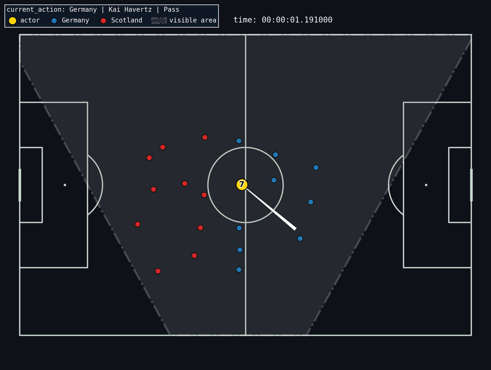
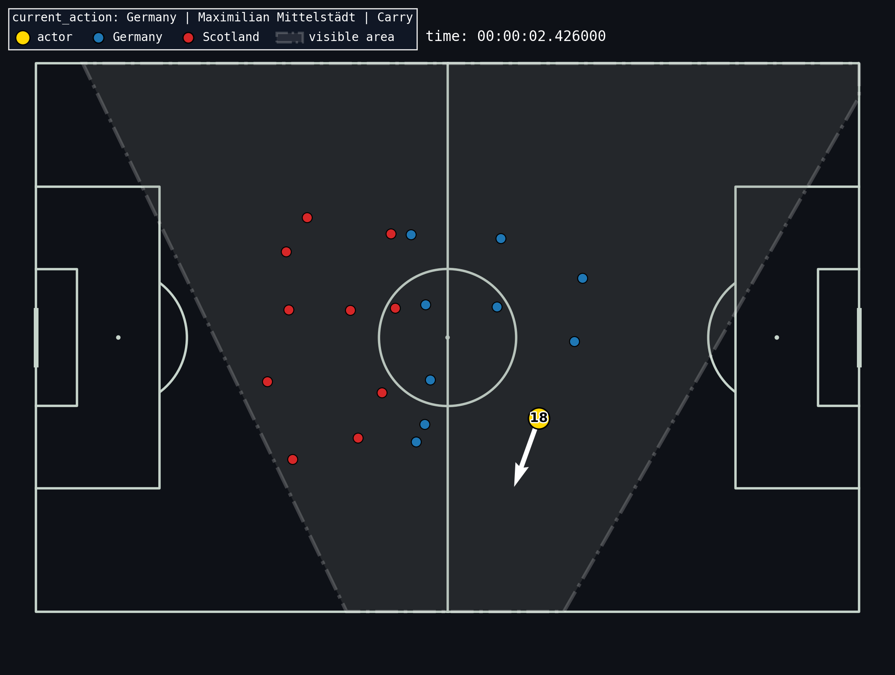
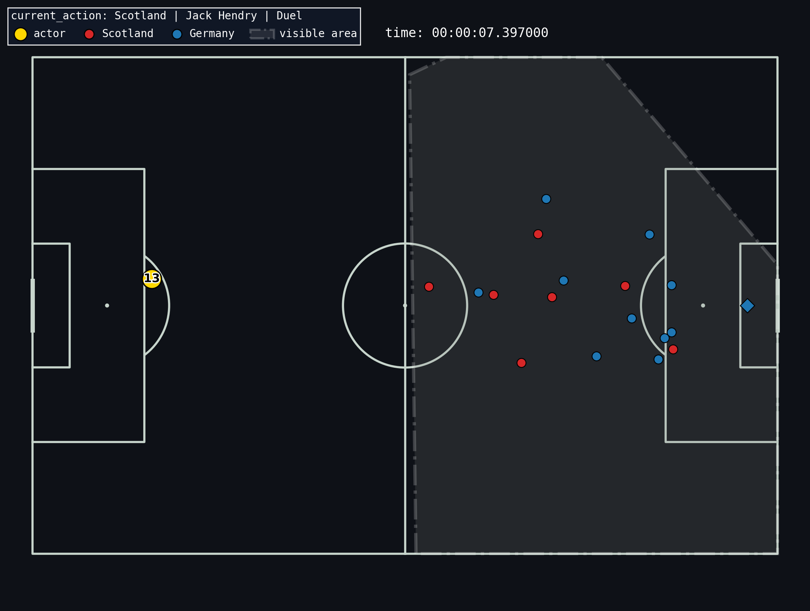

# Базовый чекпоинт ВКР: StatsBomb (Events + 360) -> Комментарий -> Озвучка

Этот репозиторий фиксирует базовый прототип пайплайна для генерации футбольного комментария по данным StatsBomb (event data + 360 freeze-frame) и последующей озвучки (TTS).

## Что сделано (базовый чекпоинт)
**Генерация производилась только по первым 15 событиям матча Германия-Шотландия ЧЕ-24 из пула событий ['Pass', 'Ball Receipt', 'Carry','Duel']**
Дальше API попросил денег(

- Разобралась со структурой данных StatsBomb:
  - `event_data` (события матча)
  - `360` (freeze-frame игроков + видимая область).
- Привела события и 360 к единой ориентации поля (чтобы не “переезжали” стороны и камера фиксировалась единожды).

| Плохо | Плохо |
|---|---|
| .png) | .png) |

| Хорошо | Хорошо |
|---|---|
|  | |

Однако баги в данных все равно бывают и их не исправить (действия происходит рядом с левым игроком, но при этом все другие футболисты оказываются в другой половине поля)

- Визуализировала эпизоды (событие + траектория + freeze-frame) и сохраняла картинки в `event_images/`.
- Сгенерировала текстовый live-комментарий по эпизодам через GigaChat API c картинками и без и складывала результаты в `outputs/commentary_log.txt` и `outputs/commentary_log_2.txt`
- Прогнала озвучку комментариев (TTS) и собрала аудио артефакты в `outputs/`.

## Пример результата (фрагмент)

Фрагмент таблицы по озвученным комментариям (картинка + event_json + 360_json) 
audio_sec - длительность озвученного фрагмента в секундах

| idx | timestamp | type | chars | audio_sec | text |
|---:|:--|:--|---:|---:|:--|
| 1 | 00:00:01.191 | Pass | 66 | 5.44 | Хавертц начинает матч с центра поля, отдавая пас на Миттельштедта. |
| 2 | 00:00:02.426 | Ball Receipt* | 93 | 5.60 | Максимилиан Миттельштадт получает мяч после розыгрыша начального удара. Немцы начинают атаку. |
| 3 | 00:00:02.426 | Carry | 212 | 13.28 | Максимилиан Миттельштадт, левый защитник Германии, начинает атаку, ведя мяч от центра поля в сторону штрафной площади Шотландии. Он находится в окружении своих партнеров по команде, которые готовы поддержать его. |
| 4 | 00:00:04.165 | Pass | 136 | 13.52 | Максимилиан Миттельштадт, левый защитник Германии, делает высокий пас левой ногой на Кай Хаверца. Пасы от ворот, мяч летит на 57 метров. |
| 5 | 00:00:07.397 | Ball Receipt* | 90 | 8.32 | Кай Хаверц получает мяч после розыгрыша начального удара. Немецкая команда начинает атаку. |
| 6 | 00:00:07.397 | Duel | 178 | 12.56 | В центре поля разыгрывается верховая борьба. Джек Хендерсон из Шотландии пытается выиграть мяч в воздухе, но, к сожалению, проигрывает дуэль. Мяч уходит в сторону ворот Германии. |
| 7 | 00:00:07.397 | Pass | 103 | 7.92 | Хавертц пытается отдать пас, но под давлением соперника теряет мяч. Шотландцы перехватывают инициативу. |
| 8 | 00:00:08.713 | Carry | 207 | 14.56 | Джек Хендерсон, центральный защитник сборной Шотландии, начинает движение с мячом после начального удара. Он находится под давлением и пытается продвинуться вперёд, но пока остаётся в своей штрафной площади. |
| 9 | 00:00:09.544 | Pass | 144 | 10.80 | Джек Хендерсон пытается начать атаку Шотландии, но его пас на 1,8 метра оказывается неточным и перехвачен соперником. Немцы быстро контратакуют. |
| 10 | 00:00:13.928 | Carry | 192 | 11.92 | И сразу же после удара по воротам, Джонатан Та, центральный защитник сборной Германии, подбирает мяч и начинает движение с ним. Он пытается стабилизировать игру после опасного момента у ворот. |
| 11 | 00:00:15.597 | Pass | 127 | 8.48 | И сразу же после розыгрыша мяча, Джонатан Тах делает пас на Роберта Андриха. Немцы продолжают контролировать мяч в центре поля. |
| 12 | 00:00:16.068 | Ball Receipt* | 222 | 14.00 | Роберт Андрич из Германии получает мяч после розыгрыша начального удара. Он находится в центре поля, рядом с ним несколько игроков обеих команд. Шотландцы пытаются оказать давление на немца, чтобы не дать ему начать атаку. |
| 13 | 00:00:16.068 | Carry | 192 | 14.72 | Роберт Андрич, полузащитник сборной Германии, начинает движение с мячом, уводя его от центра поля в сторону правой бровки. Он находится под небольшим прессингом, но пока контролирует ситуацию. |
| 14 | 00:00:17.112 | Pass | 184 | 13.20 | Роберт Андрич из Германии делает пас на Антонио Рюдигера. Это короткий пас на 15 метров, выполненный правой ногой. Игра только началась, и мяч пока находится на половине поля Германии. |

Склеенная по всем комментариям озвучка: [commentary_tts_qwen_male_commentator.wav](outputs/commentary_tts_qwen_male_commentator.wav)

## Пример результата (фрагмент без подачи картинки)
Попробовала написать подробный промпт и передавать только два json
| idx | timestamp | type | chars | text |
|---:|:--|:--|---:|:--|
| 1 | 00:00:01.191 | Pass | 93 | Немецкий центрфорвард Кай Хавертц начинает встречу с передачи на Максимаиллиана Миттелштадта. |
| 2 | 00:00:02.426 | Ball Receipt* | 80 | Максимилиан Миттелштадт, левый бек сборной Германии, начинает матч с приема мяча |
| 3 | 00:00:02.426 | Carry | 128 | Немецкий левый бек Максимилиан Миттелштадт начинает матч с ведения мяча от центра поля в сторону правой половины поля Шотландии. |
| 4 | 00:00:04.165 | Pass | 93 | Немецкий левый бек Максимилиан Миттелштадт делает высокую передачу левой ногой на Кай Хаверц. |
| 5 | 00:00:07.397 | Ball Receipt* | 105 | Кай Хавертц, центрфорвард сборной Германии, принимает мяч на левой бровке и начинает атаку своей команды. |
| 6 | 00:00:07.397 | Duel | 88 | Центральный защитник Шотландии Джек Хендри вступает в борьбу в воздухе, но теряет дуэль. |
| 7 | 00:00:07.397 | Pass | 110 | Центральный нападающий Германии Кай Хавертц пытается начать атаку своей команды, выполняя короткий пас вперед. |
| 8 | 00:00:08.713 | Carry | 119 | Центрбек шотландской команды Джек Хендри начинает матч с аккуратной передачи, направляя мяч своему партнеру по обороне. |
| 9 | 00:00:09.544 | Pass | 117 | Центральный защитник Шотландии Джек Хендри пытается сделать короткую передачу низом, однако пас оказывается неточным. |
| 10 | 00:00:13.928 | Carry | 71 | Немецкий защитник Янник Та начинает матч с ведения мяча от центра поля. |
| 11 | 00:00:15.597 | Pass | 73 | Немецкий защитник Янник Та делает пас на своего партнёра Роберта Андрича. |
| 12 | 00:00:16.068 | Ball Receipt* | 97 | Немецкий правый центральный полузащитник получает мяч на средней линии и начинает развивать атаку |
| 13 | 00:00:16.068 | Carry | 99 | Немецкий правый центральный полузащитник начинает атаку своей команды, ведя мяч вдоль боковой линии |
| 14 | 00:00:17.112 | Pass | 60 | Роберт Андрич делает пас своему защитнику Антонио Рюдэриджу. |

## Где что лежит

- Данные матча (пример):
  - `3930158_std_events.json` (events, стандартизированные)
  - `3930158_std_360.json` (360, стандартизированные)
- Визуализации эпизодов: `event_images/`
- Логи комментариев: `outputs/commentary_log.txt`, `outputs/commentary_log_2.txt`
- Пример аудио: `outputs/commentary_tts_qwen_male_commentator.wav`
- Бенчмарк/прогон TTS: `tts_benchmark_hf.ipynb`
- Ноутбук по StatsBomb + генерации: `statsbomb copy.ipynb`
- Мини-библиотека с кодом пайплайна: `statsbomb_toolkit/`
  - `statsbomb_toolkit/data.py` (нормализация, flip/стандартизация координат, чистка)
  - `statsbomb_toolkit/viz.py` (отрисовка поля/события/360)
  - `statsbomb_toolkit/gigachat.py` (клиент GigaChat API)

## Полезное
Запись видео-трансляции этого матча в вк

https://vk.ru/video-234512527_456239594
